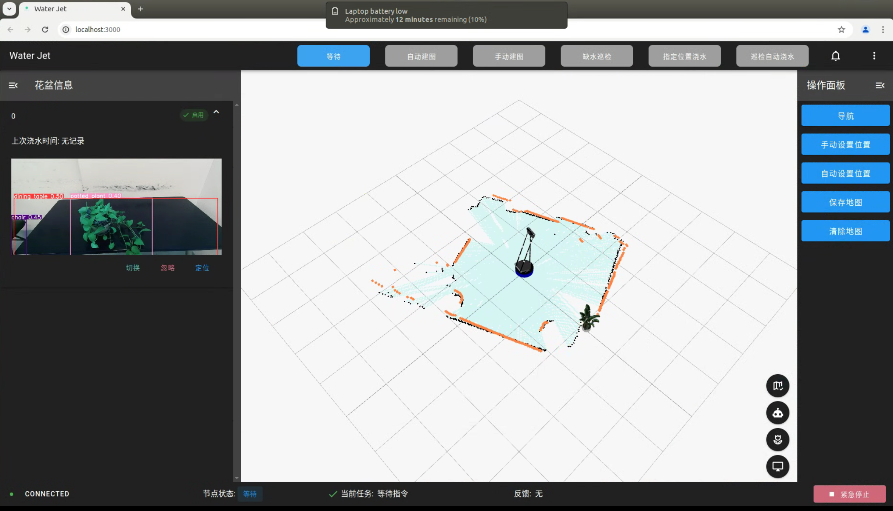

<div align="center">

# Water-Jet：浇花机器人——温室管家 🔫💦
[](https://github.com/bulletproof-system/water-jet/stargazers)
[](https://github.com/bulletproof-system/water-jet/blob/main/LICENSE)
[](https://github.com/bulletproof-system/water-jet/issues)
[](https://github.com/bulletproof-system/water-jet/issues)

</div>

## 👋 简介

Water Jet，简称 **WJ**，是一个由 [LTT](https://github.com/bulletproof-system) 领导的大型软件工程项目，其项目规模之大、覆盖之广、性能之高、程度之细均令人叹为观止，在北航 6 系 2024 春季学期的**软件工程 - 嵌入式**班上取得了傲人成绩。

Water Jet 旨在为用户提供一款高度智能化的温室浇花机器人解决方案。本项目针对当前温室种植业中面临的劳动力成本增加和管理效率低下等痛点，融合了最新机器人技术与人工智能，致力于提升温室管理的自动化与智能化水平。通过精确建图、动态避障等功能，Water Jet 能够自动执行浇水任务，确保作物在最佳的水分条件下生长，非常适合温室作物的精细护理。


## 🌱 项目特色

- 🌈 **超级温室英雄**：一位超级英雄正在你的温室里游走！它不是披着斗篷的侠客，而是一个身怀绝技的浇花机器人——**WJ**！
- ✨ **智能如你所愿**：聪明的 **WJ** 懂得自己绘制温室地图，无需你动一根手指，它就能自动扫描，搞定一切！
- 🎮 **绝妙上手体验**：或者，你更想亲自动手？没问题！拿起手柄或操控键盘，化身指挥官，亲自引领它完成建图任务，享受科技与乐趣的完美融合！
- 🕵️‍♂️ **维护小能手**：我们的 **WJ** 还是个细心的园艺侦探，时刻检查每盆花的位置，确保它们乖乖待在原地，一有风吹草动，立刻更新植物数据库，比你记得还清楚！
- 💧 **精准灌溉大师**：无论是定点浇水，还是自动巡检，**WJ** 都是植物的私人水疗师。它能感应每一株花卉的渴求，及时雨露均沾，让每一朵花儿都喝饱饱、美滋滋！
- 🚧 **障碍？不存在的**：面对杂乱无章的温室，**WJ** 能像忍者一样躲避障碍，优雅穿梭，保证每次任务都能安全又高效地完成。
- 🚫 **紧急刹车，安全第一**：除了内置的物理急停按钮，指尖轻轻一点屏幕，就能让 **WJ** 即刻停止，安全系数满格！
- 😊 **人机交互，轻松愉悦**：由 **LTT** 一手设计的超级友好的交互界面，让你和 **WJ** 交流无障碍，查询、切换模式，就像和老朋友聊天一样简单！
- 💪 **强大主控**：在 **LTT** 的英明领导下，我们构建了完备的主控模块，**WJ** 现在支持 1 + 1 + 6 的多模式作业！

<div align="center">
	<table>
  		<tr>
    		<td></td>
    		<td></td>
  		</tr>
	</table>
</div>


## 🚀 部署

一键部署脚本
```bash
source deploy.sh
```

> [!warning]
>
> 可能需要再次运行 `scripts/setup_miniconda.sh` 

## 🖥 前端

```bash
# 启动前端
cd frontend
pnpm preview # deploy 后已经运行了 pnpm build
```

详细介绍见 [前端 README](frontend/README.md)

## 🤖 ROS

```bash
# 启动 ROS
roslaunch controller use_case_1.launch # 真实环境
roslaunch controller use_case_1_sim.launch # 仿真环境
```

详细介绍见 [ROS端 README](ros/README.md)

## 🏅 致谢

- [ultralytics/ultralytics](https://github.com/ultralytics/ultralytics)


## 🖊 引用

```bibtex
@misc{2024waterjet,
    title={Water-Jet},
    author={LTT, Mxode, Hao7un, Kun, Le},
    howpublished = {\url{https://github.com/bulletproof-system/water-jet}},
    year={2024}
}
```


## 📑 开源许可证

本项目采用 [GNU General Public License v3.0 开源许可证](https://github.com/bulletproof-system/water-jet/blob/main/LICENSE)。


## ⭐ Contributors

<a href="https://github.com/bulletproof-system/water-jet/graphs/contributors">
  
</a>
