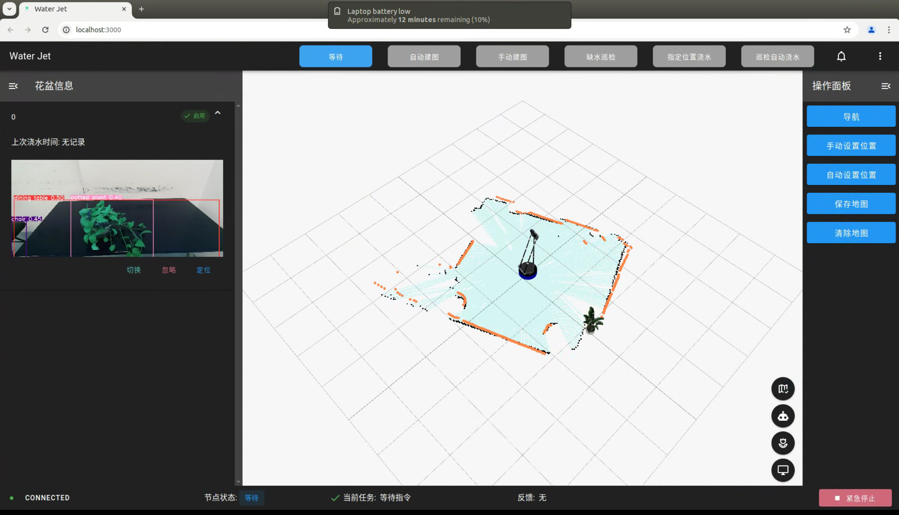

# water-jet 前端

## 📖 介绍

water-jet 前端项目, 使用 Vue3 + Vite + Vuetify3 开发, 能够在前端实现模式切换、花盆信息展示、3D地图、状态反馈等功能。

<table>
  <tr>
    <td></td>
    <td></td>
  </tr>
</table>

## 💿 运行

建议使用 `pnpm`。

```bash
pnpm install # 安装依赖
pnpm build
pnpm preview 
```

## ✨ 特点

- 🗺️ **看个地图还需要 rviz?** 我们用 [Three.js](https://threejs.org/) 实现了一个。
  - 地图展示
  - 自由视角
  - 机器人视角
  - 花盆视角
  - 标注航点

- ⛓️‍💥 **后端是什么?** 我们的前端直接与 ROS 通信。
- 🪴 **花盆信息展示:** 可折叠的花盆信息展示栏, 与地图和巡检操作同步。
- 📹 **状态监控:** 状态栏实时显示 ROS 连接和工作状态。 

## 💡 开发

```bash
pnpm dev # 启动开发模式
```

> [!tip]
>
> 如果不连接 ROS, 需要将 `src/stores/app.ts` 中的 `debug` 设置为 `true`

### 🗂️ 文件说明

```none
frontend
├── public # 机器人材质, 花盆模型文件
├── src
│   ├── assets 						# logo 文件
│   ├── components 					# vue 组件
│   │   ├── AppBar.vue 				# 顶栏
│   │   ├── AppFooter.vue 			# 状态栏
│   │   ├── Map 					# 地图组件
│   │   │   ├── Map.vue 			# 3D 地图
│   │   │   └── others 				# 地图组成成分
│   │   ├── OperatorPanel 			# 操作面板
│   │   │   ├── OperatorPanel.vue 	# 面板总体结构
│   │   │   └── others 				# 各模式对应面板
│   │   ├── PotInfo.vue 			# 花盆信息标签
│   │   └── PotList.vue 			# 花盆列表
│   ├── pages 						# 路由页面
│   ├── stores 						# 状态管理
│   │   ├── app.ts 					# 全局状态
│   │   ├── index.ts
│   │   ├── map.ts 					# 地图状态
│   │   └── ros.ts 					# ROS 状态
│   └── styles # 样式
└── README.md
```

### 📦 相关包说明

- [roslibjs](https://github.com/RobotWebTools/roslibjs) 提供与 ROS 交互的能力
- [Three.js](https://threejs.org/) 前端 3D 库
- [TresJS](https://docs.tresjs.org/zh/guide/) 把 Threejs 当 Vue 组件使用


