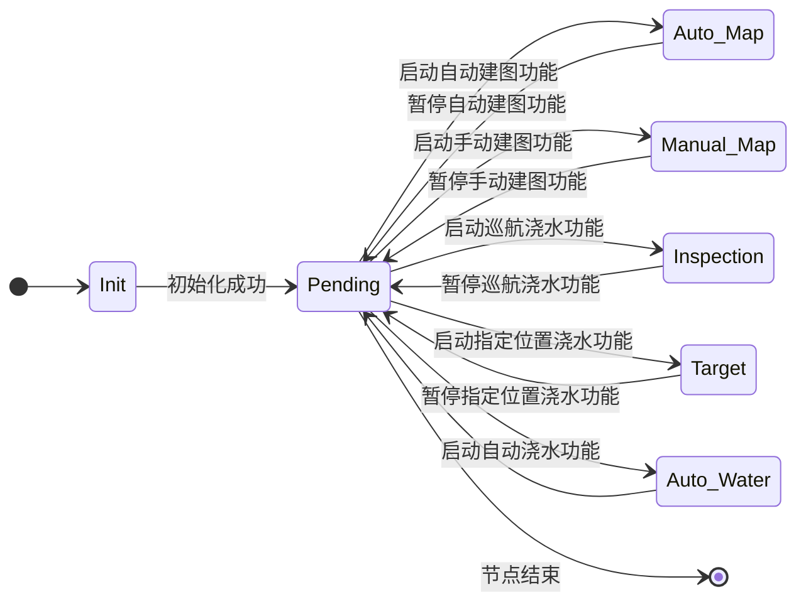
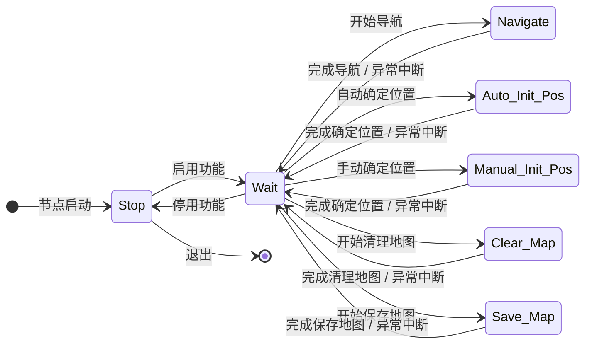
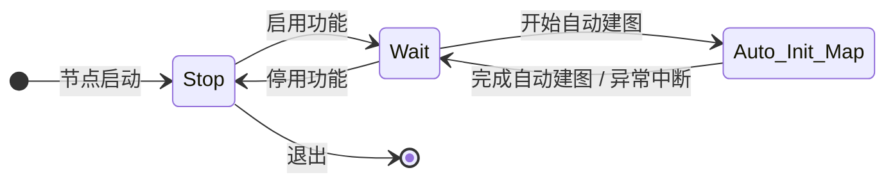
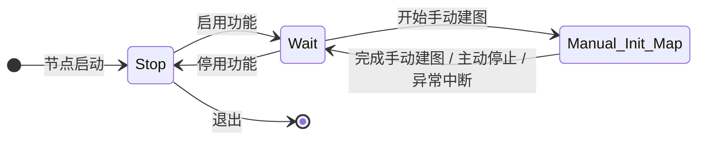
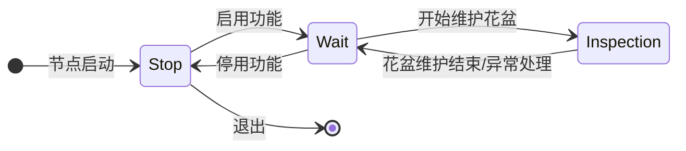
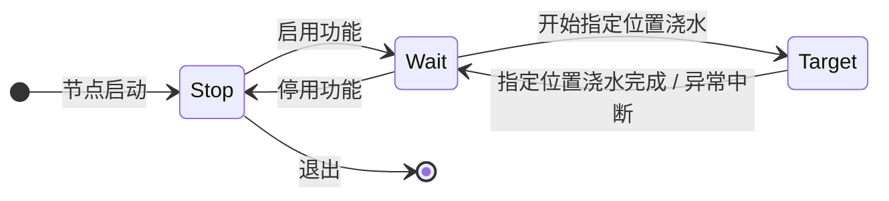
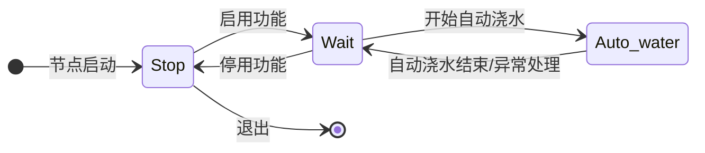

# ROS端controller包说明
## core

- 初始化
- 控制全局状态

### 状态转移




### Subscribed Topics

- `/_cmd_vel`
  其他节点发布的运动信息
  - type: `/geometry_msgs/Twist.msg`

- `/hello`

  ```
  # /controller/msg/Hello.msg
  
  string publisher
  ```

  前端启动信息

### Published Topics

- `/ctrl/info`

  全局状态信息

  ```
  # /controller/msg/Info.msg
  # global mode
  uint8 INIT=0
  uint8 PENDING=1
  uint8 AUTO_MAP=2
  uint8 MANUAL_MAP=3
  uint8 INSPECTION=4
  uint8 TARGET=5
  uint8 AUTO_WATER=6
  
  Header header
  uint8 mode # 全局模式
  bool scram # 急停状态
  ```
  
- `/cmd_vel`

  控制机器人运动

  - type: `/geometry_msgs/Twist.msg`

### Services

- `/ctrl/start`

  启动当前模式功能

  ```
  # /controller/srv/Start.srv
  uint8 mode # 如果 mode 与当前 mode 不一致, 返回 false
  ---
  bool success # 结果
  ```

- `/ctrl/stop`

  停止当前模式功能

  ```
  # /controller/srv/Stop.srv
  uint8 mode # 如果 mode 与当前 mode 不一致, 返回 false
  ---
  bool success # 结果
  ```

- `/ctrl/change_mode`

  更改模式

  ```
  # /controller/srv/ChangeMode.srv
  uint8 mode # 更改到该 mode, 这里 mode 不能为 Init
  ---
  bool success # 结果
  ```

- `/ctrl/scram`

  切换急停, 启用后 `/cmd_vel` 输出为 0

  ```
  # /controller/srv/Scram.srv
  bool active # 切换急停
  ---
  bool success # 结果
  ```

## Pending

等待状态

### 状态转移



### Subscribed Topics

- `/hello`

  - type: `Hello.msg`

  前端启动信息

### Publish Topics

- `/ctrl/node_info`

  ```
  # /controller/msg/NodeInfo.msg
  # 通用
  uint8 Stop=0
  uint8 Wait=1
  
  # Pending
  uint8 Navigate=2
  uint8 Auto_Init_Pos=3
  uint8 Manual_Init_Pos=4
  uint8 Clear_Map=5
  uint8 Save_Map=6
  
  # Auto_Map
  uint8 Auto_Init_Map=7
  
  # Manual_Map
  uint8 Manual_Init_Map=8
  
  # Inspection
  uint8 Inspect=9
  
  # Target
  uint8 Target=10
  
  # Auto_Water
  uint8 Auto_Water=11
  
  uint8 mode # 节点模式
  uint8 state # 节点状态
  ```
  
  发布节点状态

### Services

- `/ctrl/pending/start`

  启用该节点功能

  - type: `Start.srv`

- `/ctrl/pending/stop`

  停止该节点功能

  - type: `Stop.srv`

- `/ctrl/pending/clear_map`

  清除已保存地图

  ```
  # /controller/srv/ClearMap.srv
  bool clear # 始终为 true
  ---
  bool success # 结果
  ```

- `/ctrl/pending/auto_init_pos`

  自动设置机器人位置

  ```
  # /controller/srv/AutoInitPos.srv
  string caller
  ---
  bool success # 结果
  ```

  

- `/ctrl/pending/manual_init_pos`

  手动设置机器人位置

  ```
  # /controller/srv/ManualInitPos.srv
  geometry_msgs/Pose pos # 初始位置, 世界坐标
  ---
  bool success # 结果
  ```

- `/ctrl/pending/save_map`

  保存当前地图

  ```
  # /controller/srv/SaveMap.srv
  string caller # 调用者
  ---
  bool success # 结果
  ```

  

### Actions

#### 导航

```
# /controller/action/Navigate.action
# 导航 action
geometry_msgs/Pos pos # 导航位置, 世界坐标
---
string result # 结果 'success' | 'fail' | 'cancel' | 'error'
---
uint8 percentage # 进度百分数
string cur_state # 'normal' | 'barrier'
```

##### Action Subscribed Topics

- `/ctrl/pending/navigate/goal`
  - 开始导航

- `/ctrl/pending/navigate/cancel`
  - 取消导航

##### Action Published Topics

- `/ctrl/pending/navigate/status`
  - goal 状态

- `/ctrl/pending/navigate/feedback `
  - 导航进度

- `/ctrl/pending/navigate/result`
  - 导航结果

## Auto_Map

自动建图节点

### 状态转移



### Subscribed Topics

- `/hello`

  - type: `Hello.msg`

  前端启动信息

### Publish Topics

- `/ctrl/node_info`

  - type: `NodeInfo.msg`

  发布节点状态

### Actions

#### 自动建图

- type: `/map_provider/action/InitMap.action`


##### Action Subscribed Topics

- `/ctrl/auto_map/auto_init_map/goal`
  - 开始自动建图

- `/ctrl/auto_map/auto_init_map/cancel`
  - 取消建图

##### Action Published Topics

- `/ctrl/auto_map/auto_init_map/status`
  - goal 状态

- `/ctrl/auto_map/auto_init_map/feedback `
  - 建图反馈

- `/ctrl/auto_map/auto_init_map/result`
  - 建图结果

## Manual_Map

手动建图节点

### 状态转移



### Subscribed Topics

- `/hello`

  - type: `Hello.msg`

  前端启动信息

### Publish Topics

- `/ctrl/node_info`

  - type: `NodeInfo.msg`

  发布节点状态

### Actions

#### 手动建图

- type: `/map_provider/action/InitMap.action`

##### Action Subscribed Topics

- `/ctrl/manual_map/manual_init_map/goal`
  - 开始手动建图

- `/ctrl/manual_map/manual_init_map/cancel`
  - 取消建图

##### Action Published Topics

- `/ctrl/manual_map/manual_init_map/status`
  - goal 状态

- `/ctrl/manual_map/manual_init_map/feedback `
  - 建图反馈

- `/ctrl/manual_map/manual_init_map/result`
  - 建图结果


## Inspection

缺水巡检模式

### 状态转移



### Subscribed Topics

- `/hello`

  - type: `Hello.msg`

  前端启动信息

### Publish Topics

- `/ctrl/node_info`

  - type: `NodeInfo.msg`

  发布节点状态

### Actions

缺水巡检

```
# /controller/action/Inspect.action

string caller
---
string result # 结果 'success' | 'fail' | 'cancel' | 'error'
---
uint8 percentage # 进度百分数
uint8 target # 目标花盆 id
```

##### Action Subscribed Topics

- `/ctrl/inspection/inspect/goal`
  - 开始缺水巡检

- `/ctrl/inspection/inspect/cancel`
  - 取消

##### Action Published Topics

- `/ctrl/inspection/inspect/status`
  - goal 状态

- `/ctrl/inspection/inspect/feedback `
  - 巡检反馈

- `/ctrl/inspection/inspect/result`
  - 巡检结果

## Target

指定位置浇水模式

### 状态转移



### Subscribed Topics

- `/hello`

  - type: `Hello.msg`

  前端启动信息

### Publish Topics

- `/ctrl/node_info`

  - type: `NodeInfo.msg`

  发布节点状态

### Actions

指定位置浇水

```
# /controller/action/Target.action

uint8[] targets # 目标花盆列表
---
string result # 结果 'success' | 'fail' | 'cancel' | 'error'
---
uint8 percentage # 进度百分数
uint8 target # 目标花盆 id
```

##### Action Subscribed Topics

- `/ctrl/target/target/goal`
  - 开始指定位置浇水

- `/ctrl/target/target/cancel`
  - 取消

##### Action Published Topics

- `/ctrl/target/target/status`
  - goal 状态

- `/ctrl/target/target/feedback `
  - 浇水反馈

- `/ctrl/target/target/result`
  - 浇水结果

## Auto_Water

自动浇水巡检

### 状态转移



### Subscribed Topics

- `/hello`

  - type: `Hello.msg`

  前端启动信息

### Publish Topics

- `/ctrl/node_info`

  - type: `NodeInfo.msg`

  发布节点状态

### Actions

自动浇水巡检

```
# /controller/action/AutoWater.action

string caller
---
string result # 结果 'success' | 'fail' | 'cancel' | 'error'
---
uint8 percentage # 进度百分数
uint8 target # 目标花盆 id
```

##### Action Subscribed Topics

- `/ctrl/auto_water/auto_water/goal`
  - 开始自动浇水巡检

- `/ctrl/auto_water/auto_water/cancel`
  - 取消

##### Action Published Topics

- `/ctrl/auto_water/auto_water/status`
  - goal 状态

- `/ctrl/auto_water/auto_water/feedback `
  - 浇水反馈

- `/ctrl/auto_water/auto_water/result`
  - 浇水结果
