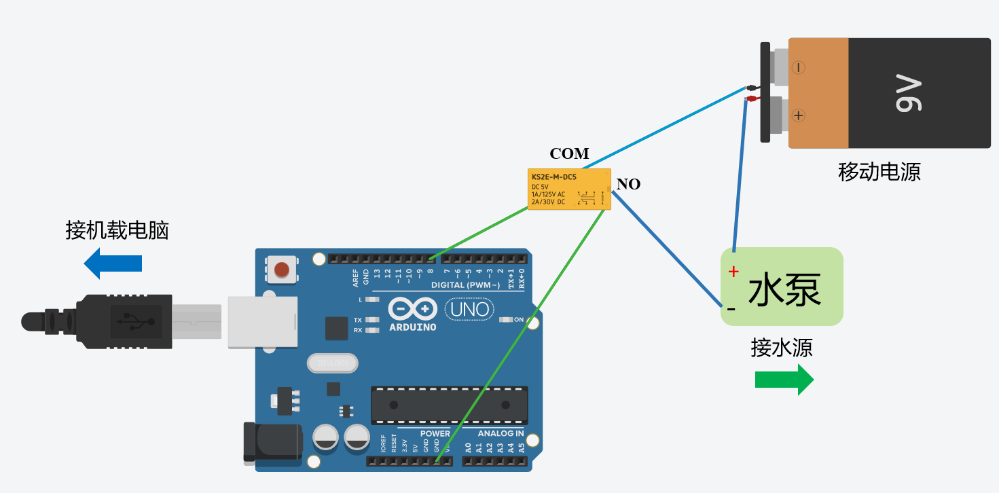

# robot_arm 包说明
## 功能
- 根据花盆三维坐标矫正机器人位置，保证正对花盆
- 机械臂移动喷水软管对准花盆
- 控制水泵通电, 给花盆浇水（温室浇花机器人的核心任务）
- 更新数据库中的植物浇水日期
- 播放语音警示词，保证浇灌作业周围环境安全

## 使用方法
1. 仿真调试:
    ``roslaunch robot_arm arm_simulation.launch``
2. 真实环境调试:
    ``roslaunch robot_arm arm.launch``

## 硬件改装
机械臂模块外接**开发板**, 借助USB串口通信控制下游水泵电源的开闭，硬件连接简图如下：
<div style="text-align: center;">
    
</div>


<br>
arm节点收到浇水命令后，向下游开发板串口发送“开启指令”为继电器通电，进而打开水泵。<br>
维持一段（浇水）时间后，arm节点向串口发送“关闭指令”，从而关闭水泵，浇花动作结束。

## robot_arm action api
```text
/aim/action/Aim.action
# 机械臂 action api
uint32 id # 花盆Id
---
bool success # 结果
string info # 反馈信息 'success' | 'fail' | 'cancel' | 'error'
---
uint32 percentage # 浇水进度百分数(0~100)
```
### Action Subscribed Topics
- `/aim/goal`
    - 开始浇水
- `/aim/cancel`
    - 取消浇水
### Action Published Topics
- `/aim/status`
    - 浇水状态
- `/aim/feedback`
    - 浇水进度
- `/aim/result`
    - 浇水结果

